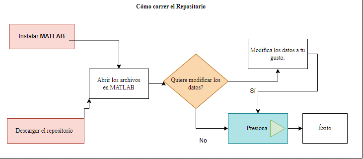
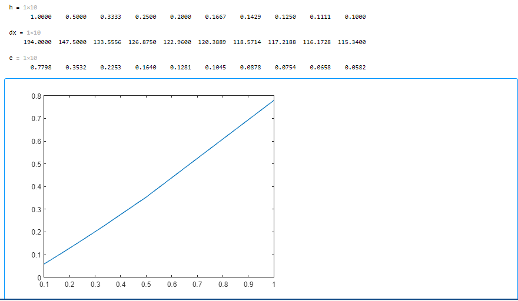

# Derivación Numérica
 

----------------

## Contenidos
------------------
* [Acerca del Repositorio](#Acerca_del_Repositorio)
    * [Funcionamiento](#Funcionamiento)
* [Instalación](#Instalación)
* [Demostración](#Demostración)
* [Proyecto a Futuro](#Futuro)
* [Contacto](#Contacto)
### Acerca del Repositorio
-------------

Derivación numérica es un repositorio donde podrás encontrar archivos para aproximar el valor de una derivada utilizando una serie de puntos. Se debe tomar en cuenta que estos métodos tienen errores de truncamiento.

El repositorio cuenta con  las siguientes funciones para realizar el calculo de la derivada:

- [First Derivative O2](FirstDerO2.mlx)
- [First Derivative O4](FirstDerO4.mlx) 
- [Second Derivative O2](SecDerivO2.mlx)
- [Second Derivative uno atrás](SegundaDerivadaUnoAtras.mlx)
- [Segunda Derivada uno centro](SegundaDerivadaUnoCentro.mlx)
- [Second Derivative uno derecha](SegundaDerivadaUnoDerecha.mlx)
- [Second Derivative OH4](secondDerivativeOH4.mlx)


### Funcionamiento 
------

En el repositorio, además de encontrar los archivos necesarios para realizar los cálculos, se les proporciona un [documento](ProyectoDer.pdf) pdf en donde podrán encontrar detalladamente toda la información relevante de cada método.
Ya que tengan abierto el archivo en MATLAB, lo único que tienen que hacer es cambiar los parámetros a lo que quieran y correr el programa.

### Instalación       
-------

Para poder correr los archivos será necesario contar con cualquier versión de MATLAB, en caso de no contar con alguna, puede ingresar a la página oficial de MATLAB y bajar una prueba gratis de 30 días. 
En cuanto a los archivos, puede bajar el repositorio el cual cuenta con toda la información necesaria.





#### Demostración

--------

1. Abrir Matlab
2. Abrir el archivo SegundaDerivadaUnoCentro.mlx 
3. Modificar los datos necesarios
	
	```
	h = 0.1;  
	
	x = 0:h:0.7;
	
	f =@(x) 1 + x + x.^4;
	
	```

4. Picarle al botón correr

Al terminar estos pasos, tendrá todos los cálculos correspondientes y los resultados se verán así.

.


### Futuro

-------

El repositorio seguirá siendo actualizado conforme se programen más funcionalidades.


### Contacto
-------

Para cualquier duda puedes mandar un correo a jvaldesdr@outlook.com


